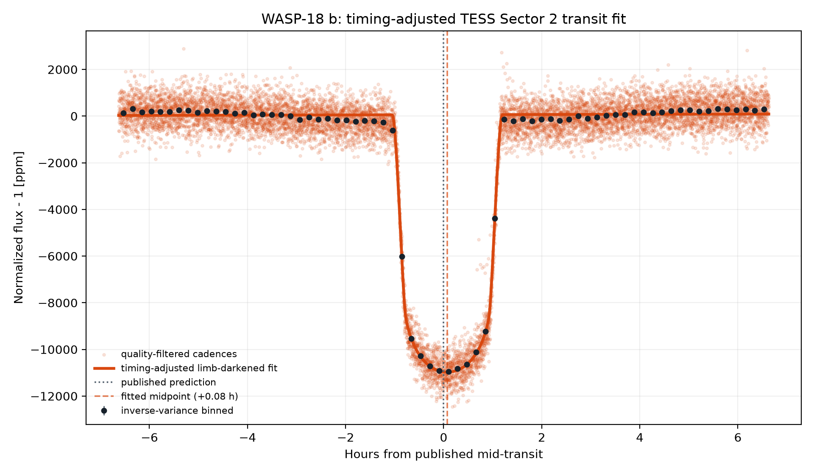
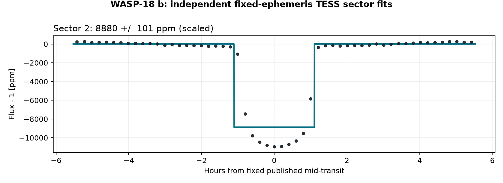
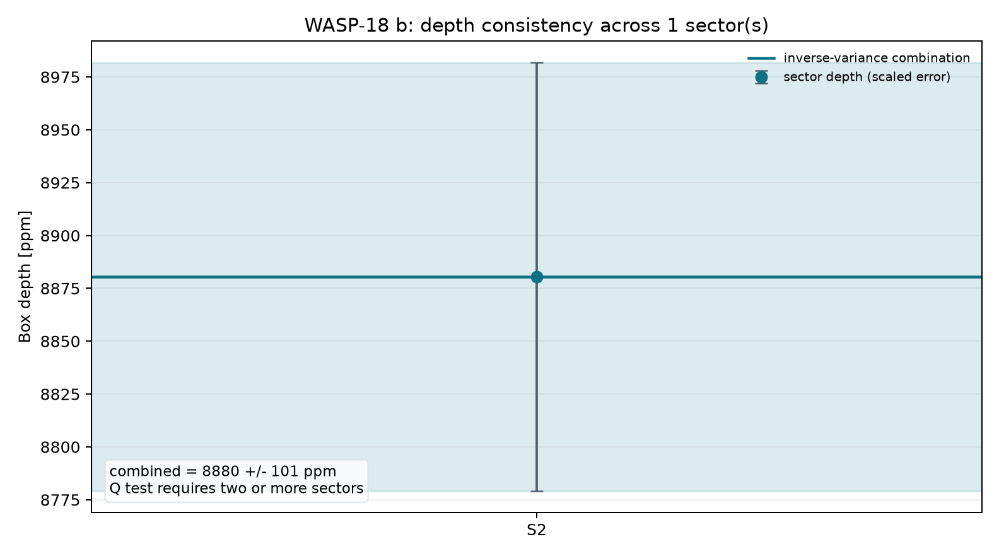
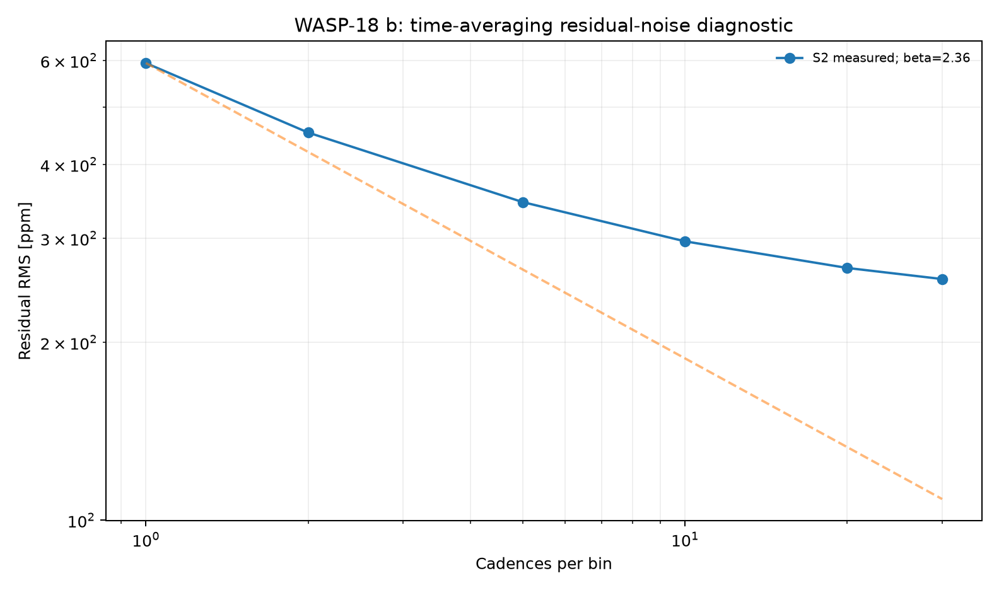
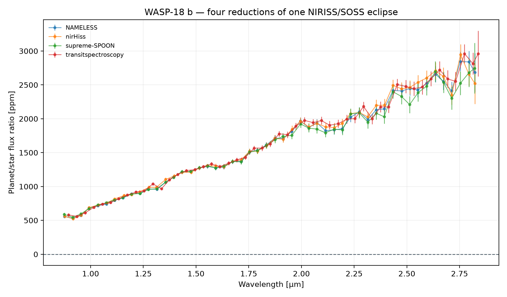
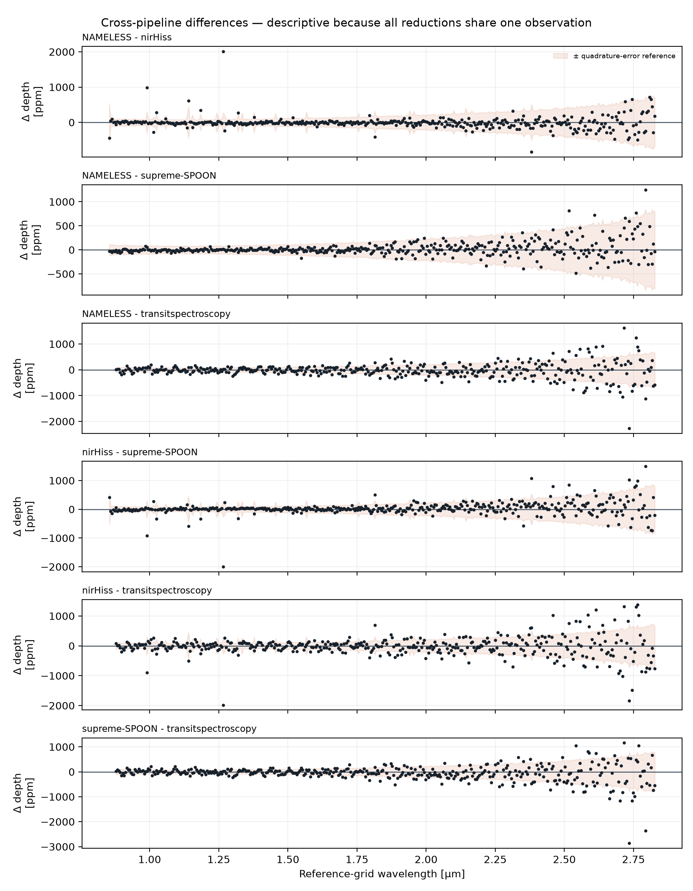
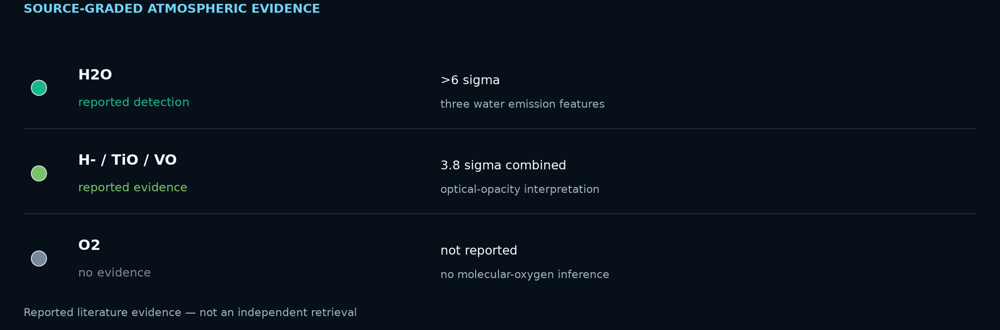

# WASP-18 b: An Ultra-Hot Jupiter in Water Emission
<!-- RESEARCH-IDENTITY-START -->
**Independent research report by [Biswajit Jana](https://biswajit1999.github.io/Biswajit_Jana.github.io/)** · [Live report](https://biswajit1999.github.io/wasp-18b-exoplanet-report/) · [ORCID](https://orcid.org/0009-0002-2411-1891) · [Complete research portfolio](https://biswajit1999.github.io/Biswajit_Jana.github.io/research/exoplanets/)
<!-- RESEARCH-IDENTITY-END -->


<!-- TARGET-IDENTITY-START -->
<p align="center">
  
</p>

<p align="center"><em>AI-generated artist's interpretation informed by the measured system properties; not a direct image.</em></p>

**Ultra-hot Jupiter · thermal inversion · JWST + TESS**

A massive, intensely irradiated giant on a 0.94-day orbit, combining a TESS transit fit with four reductions of a JWST dayside spectrum shaped by water emission.
<!-- TARGET-IDENTITY-END -->
<p align="center">
  
</p>


**[Open the full report](https://biswajit1999.github.io/wasp-18b-exoplanet-report/)** — the live GitHub Pages version.

## Data sources

- **System parameters** — the saved `pscomppars` row from the [NASA Exoplanet Archive TAP service](https://exoplanetarchive.ipac.caltech.edu/TAP/sync?query=select+pl_name%2Chostname%2Cra%2Cdec%2Cpl_orbper%2Cpl_tranmid%2Cpl_trandur%2Cpl_rade%2Cpl_bmasse%2Cpl_eqt%2Cpl_orbsmax%2Csy_dist%2Csy_tmag%2Cst_teff%2Cst_rad%2Cst_mass%2Cdisc_year%2Cdiscoverymethod%2Cdisc_refname%2Cdisc_pubdate%2Cdisc_facility+from+pscomppars+where+pl_name%3D%27WASP-18+b%27&format=csv).
- **Observed photometry** — unmodified MAST file `tess2018234235059-s0002-0000000100100827-0121-s_lc.fits`, TESS Sector 2, DOI [10.17909/t9-nmc8-f686](https://doi.org/10.17909/t9-nmc8-f686). This is a real SPOC reduced light curve, not simulated data.
- Exact URLs, IDs, retrieval date, and SHA-256 checksum are in [`data/SOURCE.md`](data/SOURCE.md).

## Reproduce the analysis

```bash
pip install -r requirements.txt
python scripts/analyze_transit.py
python scripts/analyze_multisector.py
python scripts/analyze_spectrum.py
python scripts/analyze_atmospheric_evidence.py
pytest tests/ -v
```

The script keeps finite `QUALITY == 0` cadences, normalizes `PDCSAP_FLUX`, and applies one symmetric robust outlier rule. A local linear null is compared with a circular quadratic-limb-darkened transit. The archive period and predicted phase are retained, while midpoint, radius ratio, impact parameter, baseline, and baseline slope are fitted inside a bounded window. The limb-darkening coefficients and scaled semi-major axis are fixed and disclosed in the CSV.

## What the corrected fit shows

| Quantity | Result |
|---|---:|
| TESS sector | 2 |
| Cadences in fitted window | 10726 |
| Transit support | ΔBIC ≥ 10 |
| Midpoint correction | +0.075 h ± 0.05 min |
| Model mid-transit depth | 11032.1 ± 18.6 ppm |
| Radius ratio Rp/Rs | 0.09975 |
| Fitted / published duration | 2.225 / 2.210 h |
| Linear null χ² / dof / BIC | 467136.90 / 10724 / 467155.46 |
| Transit χ² / dof / BIC | 12774.63 / 10721 / 12821.04 |
| ΔBIC (null − transit) | 454334.42 |

The timing-adjusted transit is strongly preferred by ΔBIC = 454334.4. Its fitted midpoint is +0.075 hours from the historical prediction; the model's mid-transit depth is 11032.1 ± 18.6 ppm. A fitted timing correction can diagnose ephemeris drift, but this single-sector fit is not a replacement for a global transit-timing analysis.

<!-- MULTISECTOR-UPGRADE-START -->
## Multi-sector robustness and correlated noise

The archive prediction was timing-adjusted independently in 1 fitted sector(s) (S2), of which 1 meet Delta BIC >= 10. Formal depth errors were inflated by sqrt(max(reduced chi-square, 1)) times the residual time-averaging beta factor (observed range 2.36-2.36). The robust inverse-variance model depth across supported sectors is 11032.1 +/- 43.8 ppm; a sector-to-sector Q test requires at least two supported sectors. These scaled errors address underestimated scatter and short-timescale correlation, but they are not a full Gaussian-process or physical limb-darkened transit fit.

<p align="center"></p>

<p align="center"></p>

<p align="center"></p>

The per-sector table is in [`figures/multisector_statistics.csv`](figures/multisector_statistics.csv). Regenerate all three figures with `python scripts/analyze_multisector.py`.
<!-- MULTISECTOR-UPGRADE-END -->

<!-- SPECTRUM-UPGRADE-START -->
## Published planetary spectrum

<p align="center"></p>

These are four correlated reductions of the same NIRISS/SOSS eclipse observation—not four independent observations. Each delivered spectrum rejects its own weighted-flat model (reduced χ² 17.0–22.7), establishing wavelength structure only. That test is not a molecular detection or an atmospheric retrieval.

<p align="center"></p>

All six wavelength-resolved pipeline pairs are compared on their overlap. Median absolute differences span 39.2–112.6 ppm; pairs involving `transitspectroscopy` have the largest median spread (106.7–112.6 ppm). The plotted quadrature-error bands are descriptive independence references: shared photons and common calibration steps mean the pairwise residuals are correlated, so they are not formal consistency probabilities.

Source: [10.5281/zenodo.7907569](https://zenodo.org/records/7907569) (JWST NIRISS/SOSS). Exact files and checksums are in [`data/SOURCE.md`](data/SOURCE.md); complete numerical results are in [`figures/spectrum_statistics.csv`](figures/spectrum_statistics.csv).
<!-- SPECTRUM-UPGRADE-END -->

<!-- ATMOSPHERE-EVIDENCE-START -->
## Atmospheric evidence: detection, limit, or unknown?

<p align="center"></p>

Four correlated reductions of one eclipse show strong wavelength structure. The species-level and thermal-inversion statements below come from the published retrieval and opacity-removal tests, not from this repository's flat-spectrum or pipeline-agreement diagnostics.

| Species | Status | Evidence | Basis |
|---|---|---|---|
| H2O | reported detection | >6 sigma | three water emission features |
| H- / TiO / VO | reported evidence | 3.8 sigma combined | optical-opacity interpretation |
| O2 | no evidence | not reported | no molecular-oxygen inference |

Primary source: [Coulombe et al. 2023, Nature](https://doi.org/10.1038/s41586-023-06230-1). The table is also available as [`data/atmospheric_evidence.csv`](data/atmospheric_evidence.csv). Oxygen-bearing species such as H2O, CO2, and SO2 are **not** evidence for molecular oxygen (O2) or a biosignature.
<!-- ATMOSPHERE-EVIDENCE-END -->

## System context

- Radius: 13.90 Earth radii
- Mass: 3241.85 Earth masses
- Orbital period: 0.941452 days
- Transit duration: 2.210 hours
- Semi-major axis: 0.0202 AU
- Equilibrium temperature: 2429 K
- Host: WASP-18 · distance 123.48 pc
- Discovery: 2009 by Transit (SuperWASP)

## Limitations

- The orbit is assumed circular and the quadratic limb-darkening coefficients are fixed representative values; they are not atmosphere-grid interpolations.
- The scaled semi-major axis is derived from the saved composite semi-major axis and stellar radius; their uncertainties are not propagated.
- Midpoint freedom corrects accumulated ephemeris error but introduces a bounded timing search. ΔBIC, not a naïve one-parameter p-value, is used as the support gate.
- PDCSAP processing, dilution, stellar variability, transit-timing variations, and long-timescale covariance can still bias the inferred geometry.
- Radius ratio, impact parameter, and fixed limb darkening are correlated. Published global fits with physical priors and simultaneous detrending remain authoritative.
- The four NIRISS/SOSS spectra reuse one eclipse observation. Pipeline agreement probes reduction sensitivity but does not multiply the observation count or detection significance.
- Flat-spectrum rejection tests only whether eclipse depth varies with wavelength. Molecular abundances, water significance, temperature inversion, metallicity, and C/O require forward modelling or retrieval and are cited to the publication.
- Pairwise differences interpolate one reduction onto another grid and use quadrature errors as an independence reference; correlations between reductions are unavailable and no formal agreement p-value is claimed.

## Repository structure

```text
README.md
index.html
requirements.txt
data/                       unmodified TESS FITS + NASA row + SOURCE.md
scripts/analyze_transit.py  timing-adjusted limb-darkened transit fit
figures/                    generated plot + summary_statistics.csv
tests/                      real-data regression tests
.github/workflows/tests.yml CI on every push and pull request
LICENSE                     MIT
```

## References

1. [Hellier et al. 2009](https://ui.adsabs.harvard.edu/abs/2009Natur.460.1098H/abstract) — discovery reference as listed by the NASA Exoplanet Archive.
2. Ricker, G. R. et al. (2015), *Transiting Exoplanet Survey Satellite (TESS)*, JATIS 1, 014003, [doi:10.1117/1.JATIS.1.1.014003](https://doi.org/10.1117/1.JATIS.1.1.014003).
3. TESS Team, *TESS Light Curves — All Sectors*, MAST, [doi:10.17909/t9-nmc8-f686](https://doi.org/10.17909/t9-nmc8-f686); Sector 2 used here.
4. [NASA Exoplanet Archive](https://exoplanetarchive.ipac.caltech.edu/), `pscomppars` TAP row retrieved 2026-08-15.
5. Coulombe, L.-P. et al. (2023), *A broadband thermal emission spectrum of the ultra-hot Jupiter WASP-18b*, Nature 620, 292–298, [doi:10.1038/s41586-023-06230-1](https://doi.org/10.1038/s41586-023-06230-1).

## Author

Biswajit Jana — [Portfolio](https://biswajit1999.github.io/Biswajit_Jana.github.io/) · [GitHub](https://github.com/Biswajit1999) · [LinkedIn](https://www.linkedin.com/in/biswajit-jana-27011a151/) · [ORCID](https://orcid.org/0009-0002-2411-1891)
